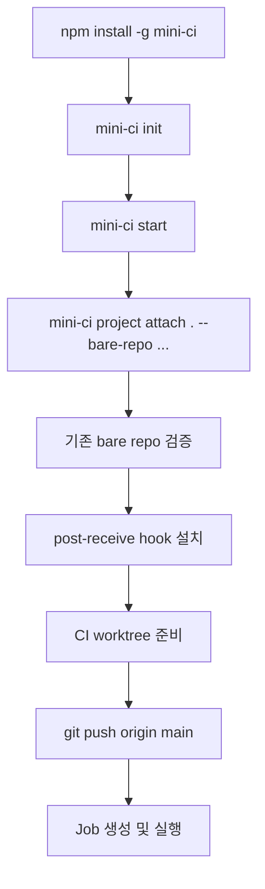
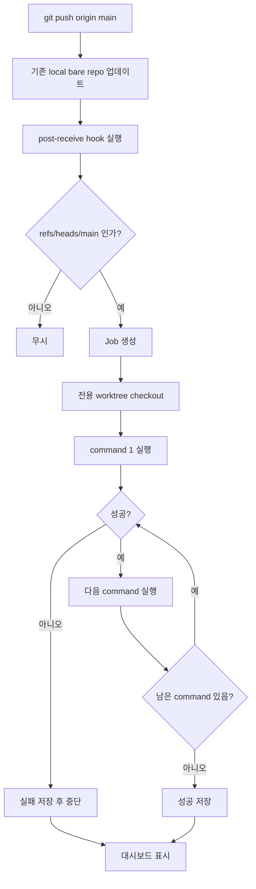

# Mini CI 핵심 설계

## 한 줄 정의

Mini CI는 기존 local bare repo, Git hook, 전용 worktree, shell command만으로 동작하는 초경량 self-hosted CI다.

개발 프로젝트와 Mini CI는 같은 컴퓨터에 있다고 가정한다.

## 설치 방법

### 1. Mini CI 설치

Input:

```bash
npm install -g mini-ci
mini-ci init
mini-ci start
```

Output:

```text
~/.mini-ci/
  mini-ci.sqlite
  logs/
  worktrees/

Dashboard: http://localhost:4177
```

동작:

- Mini CI 실행 환경을 만든다.
- SQLite DB, 로그 디렉터리, CI worktree 디렉터리를 준비한다.
- 개발 프로젝트에는 아직 아무것도 설치하지 않는다.

### 2. 기존 bare repo 연결

Input:

```bash
cd /path/to/my-app

mini-ci project attach . \
  --bare-repo /srv/git/my-app.git \
  --branch main \
  --cmd "pnpm install" \
  --cmd "pnpm test" \
  --cmd "pnpm build"
```

Output:

```text
project registered: my-app
using bare repo: /srv/git/my-app.git
post-receive hook installed
CI worktree ready: ~/.mini-ci/worktrees/my-app
```

동작:

- Mini CI가 기존 local bare repo 경로를 저장한다.
- 해당 경로가 실제 bare repo인지 검증한다.
- 기존 local bare repo에 `post-receive` hook을 설치한다.
- CI 실행용 전용 worktree를 만든다.
- 개발 프로젝트의 remote 설정은 건드리지 않는다.

### 3. CI 실행

Input:

```bash
git push origin main
```

Output:

```text
job created
commit: abc123
status: queued
```

동작:

- 기존 bare repo의 `refs/heads/main`이 업데이트된다.
- `post-receive` hook이 Mini CI에 job을 등록한다.
- Mini CI가 전용 worktree에서 해당 commit을 checkout한다.
- 등록된 command를 순서대로 실행한다.
- 결과와 로그를 대시보드에 보여준다.

## 설치 플로우



## 기능

### 1. 기존 local bare repo 연결

Input:

```bash
mini-ci project attach . --bare-repo /srv/git/my-app.git
```

Output:

```text
using bare repo: /srv/git/my-app.git
```

기능:

- 이미 사용 중인 local bare repo를 Mini CI 프로젝트에 연결한다.
- bare repo가 아니면 등록을 실패시킨다.
- 개발 프로젝트의 기존 remote 설정은 변경하지 않는다.

### 2. Git hook 기반 트리거

Input:

```text
oldCommit newCommit refs/heads/main
```

Output:

```text
job created for newCommit
```

기능:

- 기존 local bare repo의 `post-receive` hook으로 push를 감지한다.
- 설정된 브랜치가 아니면 무시한다.
- 설정된 브랜치이면 job을 만든다.

### 3. 전용 worktree 실행

Input:

```text
commit: abc123
```

Output:

```text
~/.mini-ci/worktrees/<project>
```

기능:

- Mini CI가 관리하는 worktree에서만 checkout한다.
- 개발자가 작업하는 worktree는 건드리지 않는다.
- job마다 실행 대상 commit을 명확히 남긴다.

### 4. Command 실행

Input:

```text
commands:
  - pnpm install
  - pnpm test
  - pnpm build
```

Output:

```text
status: success | failed
failedStep: test
exitCode: 1
```

기능:

- command를 등록 순서대로 실행한다.
- 하나라도 실패하면 이후 command는 실행하지 않는다.
- 실패한 step과 exit code를 저장한다.

### 5. 로그 저장

Input:

```text
stdout
stderr
exitCode
```

Output:

```text
~/.mini-ci/logs/<project>/<job>.log
```

기능:

- command 출력 전체를 로그 파일로 저장한다.
- dashboard에서 로그를 볼 수 있다.
- 실행 중인 job은 로그 tail을 볼 수 있다.

### 6. 대시보드

Input:

```text
GET /api/jobs/latest
GET /api/jobs/:id
GET /api/jobs/:id/logs
```

Output:

```text
최신 상태
실행 이력
실패 step
exit code
전체 로그
rerun 버튼
```

기능:

- 최신 job 상태를 보여준다.
- job 실행 이력을 보여준다.
- 실패 원인과 로그를 보여준다.
- 같은 commit으로 재실행할 수 있다.

## 실행 플로우



## `main`과 `origin/main`

사용자는 보통 `main`만 입력하면 된다.

- `main`: 개발 worktree의 로컬 브랜치
- `origin/main`: fetch로 가져온 remote tracking branch
- `refs/heads/main`: bare repo 안의 실제 main ref

Mini CI는 hook 기반이므로 `origin/main`이 아니라 기존 local bare repo의 `refs/heads/main` 업데이트를 본다.

```text
git push origin main
-> 기존 local bare repo의 refs/heads/main 업데이트
-> post-receive hook 실행
-> Mini CI job 생성
```

## MVP에서 하지 않을 것

- 기존 `origin` remote 변경
- local bare repo 자동 생성
- 개발 프로젝트에 Mini CI용 remote 자동 추가
- GitHub Actions 호환
- 복잡한 YAML pipeline
- polling 기본 지원
- webhook 기본 지원
- PR별 CI
- 여러 프로젝트 동시 지원
- 자동 배포
- 알림 연동
- artifact 업로드
- 복잡한 권한 관리

## Codex 전달용 요약

```text
Mini CI라는 오픈소스 TypeScript 프로젝트를 만든다.

Mini CI는 같은 컴퓨터 안의 개발 프로젝트와 기존 local bare repo에 붙는 초경량 self-hosted CI다.
핵심 설치 방식은 mini-ci project attach . --bare-repo <path> 이다.

attach는 기존 local bare repo 경로를 받아 bare repo 여부를 검증하고, 해당 bare repo에 post-receive hook을 설치한다.
개발 프로젝트의 기존 remote 설정은 건드리지 않는다.

사용자는 평소처럼 git push origin main 으로 CI를 실행한다.
Mini CI는 기존 local bare repo의 refs/heads/main 업데이트를 감지하고, Mini CI 전용 worktree에서 해당 commit을 checkout한 뒤, 등록된 shell command 배열을 순서대로 실행한다.

결과는 SQLite와 로그 파일에 저장하고, dashboard에서 최신 상태, 실행 이력, 실패 step, exit code, 로그, rerun을 제공한다.

문서는 설치 방법과 기능을 중심으로 작성하고, 각 기능은 input -> output -> 동작 순서로 설명한다.
```
